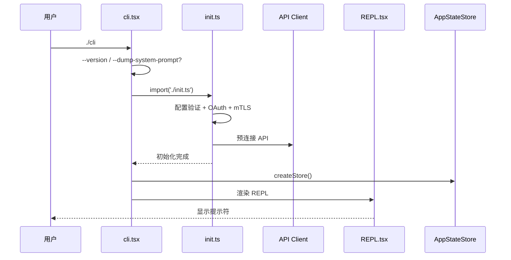

## 入口点架构

三个独立入口点：

| 入口 | 文件 | 模式 |
|------|------|------|
| **CLI** | `entrypoints/cli.tsx` | 交互式终端 |
| **MCP Server** | `entrypoints/mcp.ts` | 工具服务器 |
| **Init** | `entrypoints/init.ts` | 异步初始化 |

## 启动流程

### CLI 入口 (cli.tsx, ~39KB)

1. `COREPACK_ENABLE_AUTO_PIN=0`
2. `--version` 快速路径 (零模块加载)
3. `--dump-system-prompt` (特性门控)
4. 动态导入 `init()` → 分发到 REPL / MCP / 非交互

### MCP Server 入口

将 Claude Code 作为 MCP 工具服务器运行，通过 stdio 暴露所有内部工具 (Bash, Read, Edit, WebSearch 等)。
