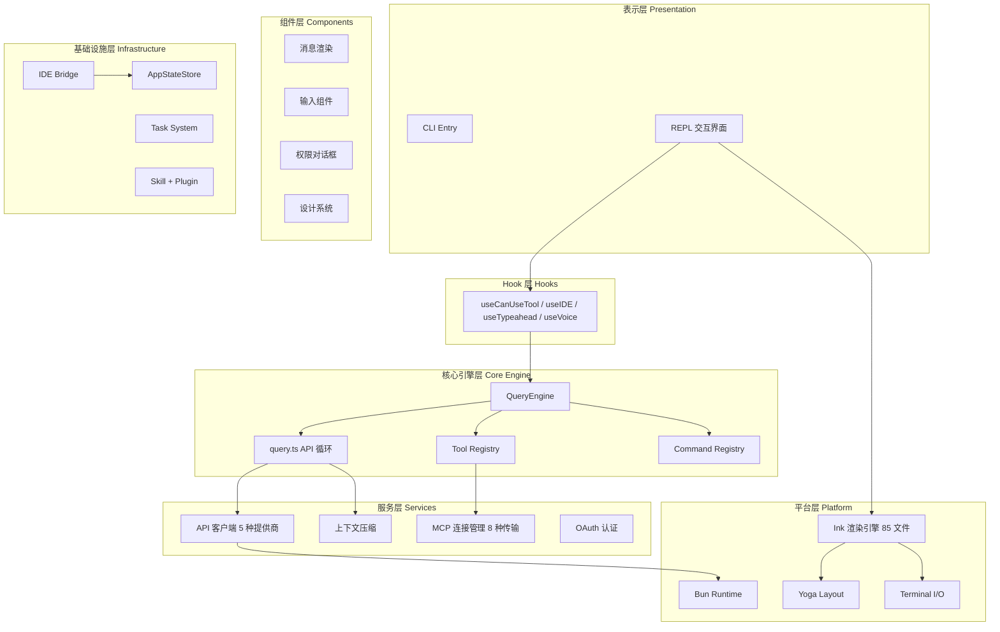

## 分层架构总览

Free-Code 采用严格的**分层架构**，从上到下共分为 7 个逻辑层。每层职责清晰，依赖方向自上而下。

## 各层职责

### 1. 平台层 (Platform)

最底层运行时基础：

| 模块 | 规模 | 职责 |
|------|------|------|
| Bun Runtime | - | 进程管理、文件 I/O、编译 |
| Ink 渲染引擎 | ~85 文件 | 终端 UI 框架，React Reconciler |
| Yoga Layout | ~5 文件 | Flexbox 布局算法 |
| Terminal I/O | ~15 文件 | ANSI/CSI 解析、键盘鼠标事件 |

Ink 从开源版本深度定制：
- 自定义 React Reconciler → 终端字符网格
- Yoga Layout → Flexbox 布局
- 完整事件系统 (键盘/鼠标/焦点/resize)

### 2. 基础设施层 (Infrastructure)

| 模块 | 文件数 | 核心职责 |
|------|--------|---------|
| **AppStateStore** | 6 | 单一状态源，持久化与序列化 |
| **IDE Bridge** | 33 | WebSocket 远程会话桥接 |
| **Task System** | 12 | 后台 Shell/Agent/Remote 任务 |
| **Skill System** | 20+ | 技能发现、加载、条件激活 |
| **Plugin System** | 6 | 插件安装、管理、市场 |

### 3. 服务层 (Services)

23 个独立服务模块：

| 服务 | 核心文件 | 功能 |
|------|---------|------|
| **api/** | claude.ts (~3420行) | LLM API 通信 |
| **mcp/** | client.ts (~3350行) | MCP 协议客户端 |
| **compact/** | compact.ts | 对话压缩 |
| **oauth/** | client.ts | OAuth PKCE 流程 |
| **lsp/** | LSPClient.ts | 语言服务器 |

### 4. 核心引擎层 (Core Engine)

| 组件 | 大小 | 职责 |
|------|------|------|
| **QueryEngine** | 46 KB | 对话生命周期，AsyncGenerator 输出 |
| **query.ts** | 68 KB | API 循环，工具执行编排 |
| **tools.ts** | 17 KB | 45+ 工具注册与特性门控 |
| **commands.ts** | 25 KB | 89+ 命令注册 |

### 5-7. 上层 (Hooks → Components → Presentation)

遵循 React 单向数据流：`Store → useAppState → Components → Ink Rendering`
