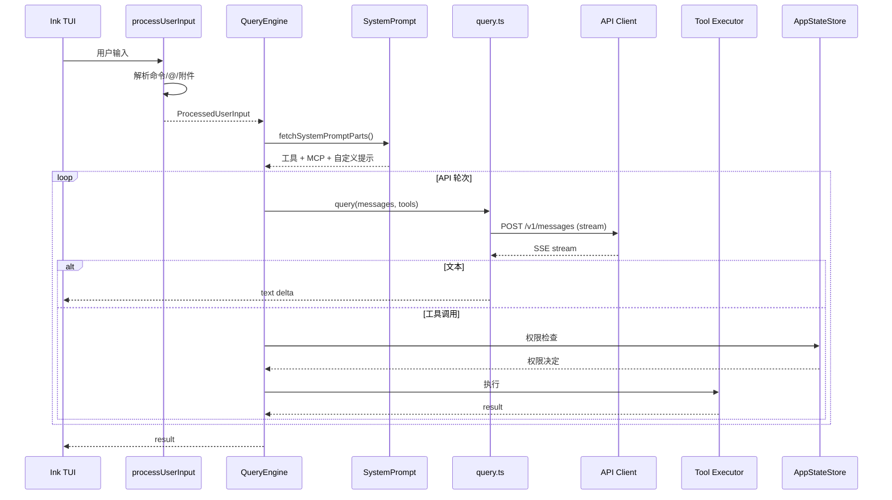
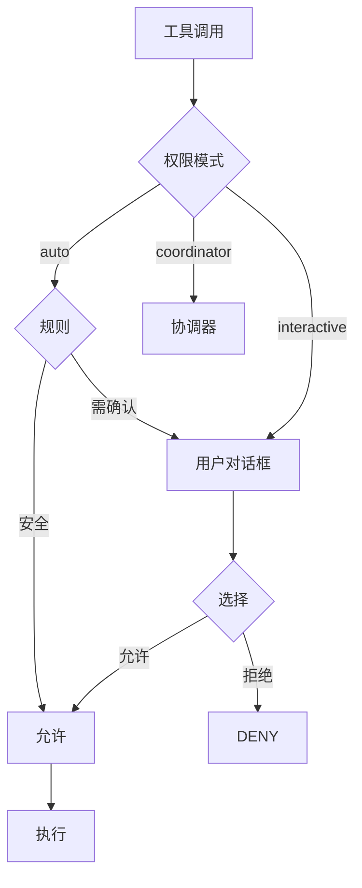
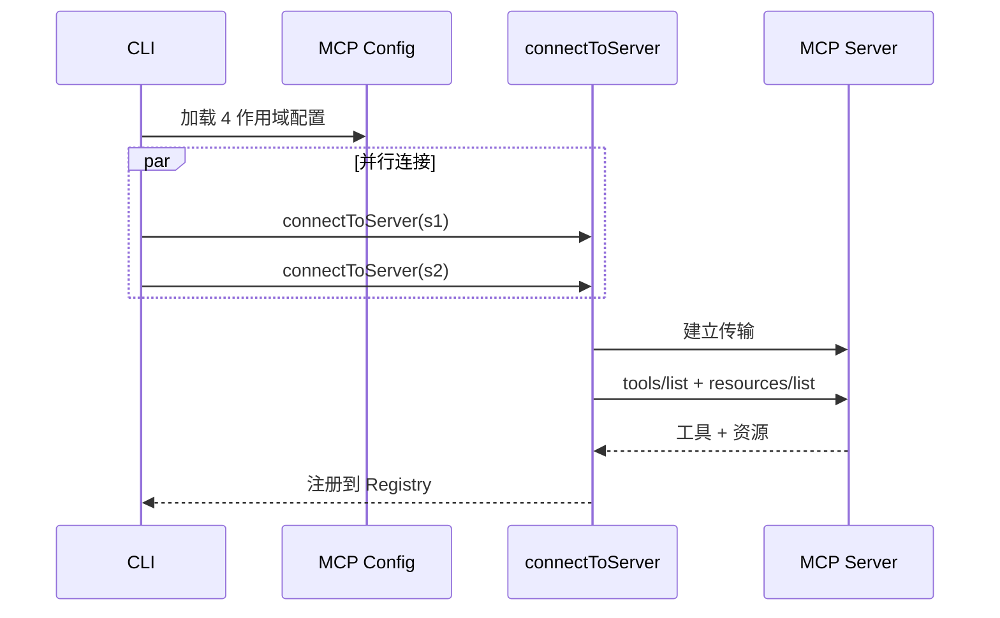
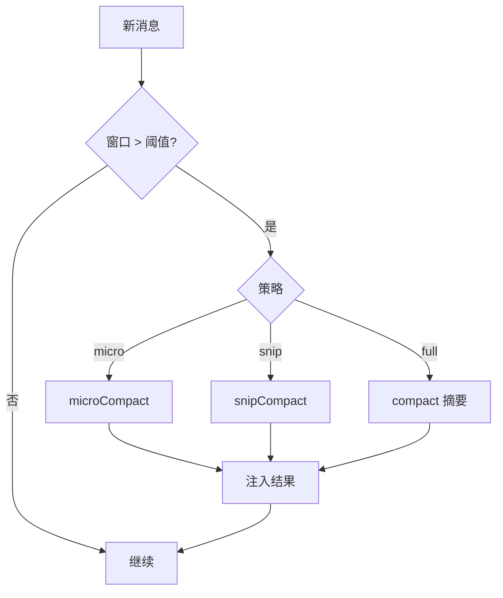
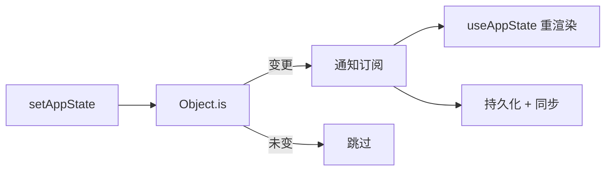

## 用户消息完整处理流程

```mermaid
sequenceDiagram
    participant TUI as Ink TUI
    participant PUI as processUserInput
    participant QE as QueryEngine
    participant SP as SystemPrompt
    participant Query as query.ts
    participant API as API Client
    participant Tool as Tool Executor
    participant Store as AppStateStore

    TUI->>PUI: 用户输入
    PUI->>PUI: 解析命令/@/附件
    PUI-->>QE: ProcessedUserInput

    QE->>SP: fetchSystemPromptParts()
    SP-->>QE: 工具 + MCP + 自定义提示

    loop API 轮次
        QE->>Query: query(messages, tools)
        Query->>API: POST /v1/messages (stream)
        API-->>Query: SSE stream
        alt 文本
            Query-->>TUI: text delta
        else 工具调用
            QE->>Store: 权限检查
            Store-->>QE: 权限决定
            QE->>Tool: 执行
            Tool-->>QE: result
        end
    end
    QE-->>TUI: result
```

## 工具调用权限流

```mermaid
flowchart TD
    TOOL[工具调用] --> CHECK{权限模式}
    CHECK -->|auto| AUTO{规则}
    AUTO -->|安全| ALLOW[允许]
    AUTO -->|需确认| DIALOG
    CHECK -->|interactive| DIALOG[用户对话框]
    CHECK -->|coordinator| COORD[协调器]
    DIALOG --> USER{选择}
    USER -->|允许| ALLOW
    USER -->|拒绝| DENY
    ALLOW --> EXEC[执行]
```

## MCP 工具发现

```mermaid
sequenceDiagram
    participant CLI as CLI
    participant Config as MCP Config
    participant Conn as connectToServer
    participant Server as MCP Server

    CLI->>Config: 加载 4 作用域配置
    par 并行连接
        CLI->>Conn: connectToServer(s1)
        CLI->>Conn: connectToServer(s2)
    end
    Conn->>Server: 建立传输
    Conn->>Server: tools/list + resources/list
    Server-->>Conn: 工具 + 资源
    Conn-->>CLI: 注册到 Registry
```

## 上下文压缩流

```mermaid
flowchart TD
    MSG[新消息] --> CHECK{窗口 > 阈值?}
    CHECK -->|否| CONT[继续]
    CHECK -->|是| STRATEGY{策略}
    STRATEGY -->|micro| MC[microCompact]
    STRATEGY -->|snip| SNIP[snipCompact]
    STRATEGY -->|full| FULL[compact 摘要]
    MC & SNIP & FULL --> INJECT[注入结果]
    INJECT --> CONT
```

## 状态同步

```mermaid
flowchart LR
    A[setAppState] --> B[Object.is]
    B -->|变更| C[通知订阅]
    B -->|未变| D[跳过]
    C --> E[useAppState 重渲染]
    C --> F[持久化 + 同步]
```
