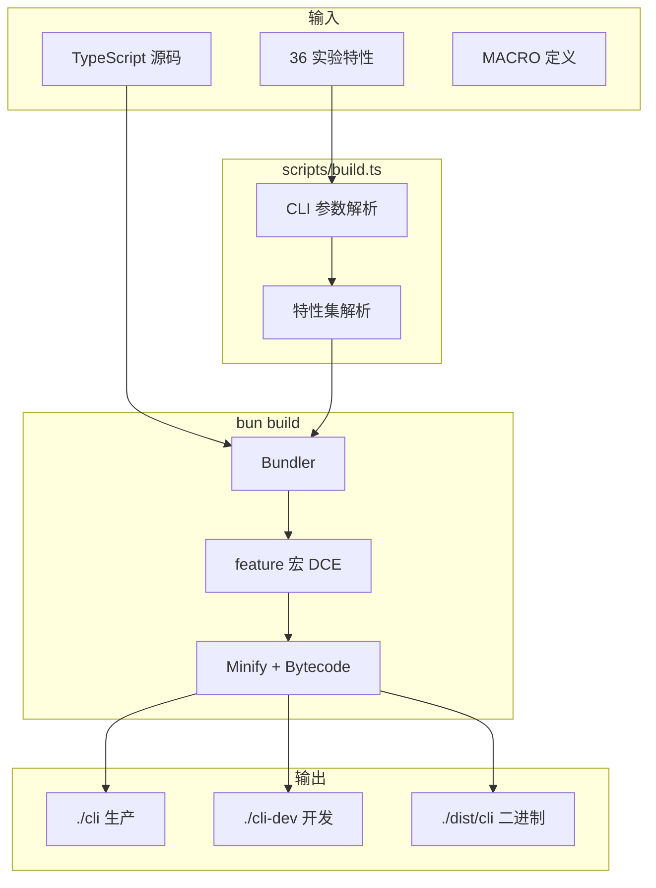

## 构建架构



## 构建命令

| 命令 | 输出 | 特性 |
|------|------|------|
| `bun run build` | `./cli` | 仅 VOICE_MODE |
| `bun run build:dev` | `./cli-dev` | + 时间戳 |
| `bun run build:dev:full` | `./cli-dev` | 54 实验特性 |
| `bun run compile` | `./dist/cli` | 独立二进制 |

## 特性门控

```typescript
import { feature } from 'bun:bundle';
if (feature('ULTRAPLAN')) { /* DCE 移除未启用代码 */ }
```

36 个实验特性: AGENT_MEMORY_SNAPSHOT, BRIDGE_MODE, ULTRAPLAN, ULTRATHINK, VOICE_MODE, SWARM_MODE, WORKTREE_MODE, COMPUTER_USE, CHROME_INTEGRATION, REMOTE_SESSIONS, TELEPORT, SANDBOX_MODE 等。

## 外部依赖

原生模块标记为 external (不打包): `@ant/*`, `audio-capture-napi`, `image-processor-napi` 等。

## 构建流程


