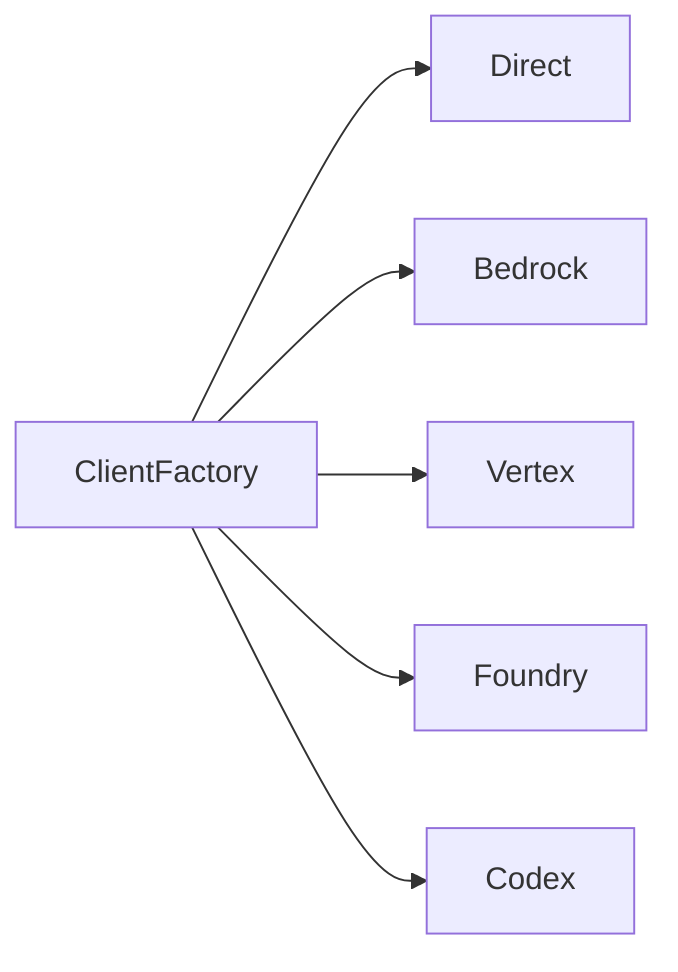
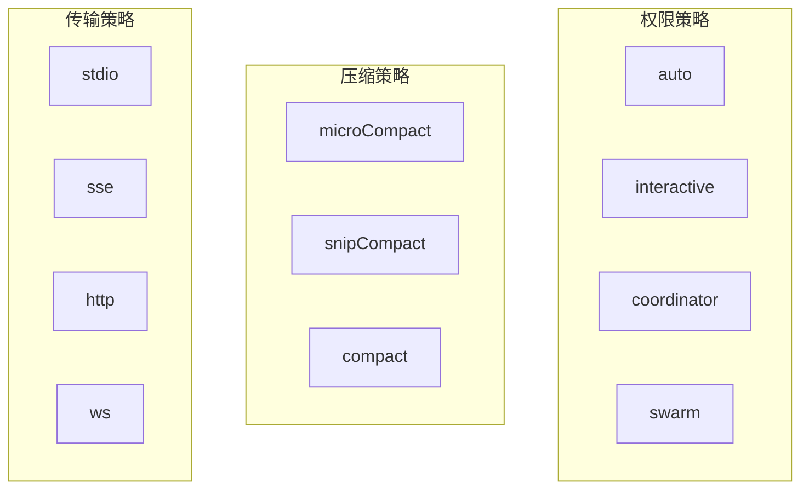

## 模式总览

### 1. 注册表模式 (Registry)

命令 (`commands.ts`)、工具 (`tools.ts`)、任务 (`tasks.ts`) 均使用集中注册 + 特性门控:

```typescript
const commands = [
  ...(feature(FLAG) ? [cmd1] : []),
  cmd2, cmd3, ...
];
```

### 2. AsyncGenerator 模式

`QueryEngine.submitMessage()` 流式产出结果:

```typescript
async function* submitMessage(prompt) {
  yield systemInit;
  for await (const event of query(...)) yield transform(event);
  yield result;
}
```

### 3. 工厂模式

API 客户端根据环境变量选择提供商:



### 4. 观察者模式

Store 使用 `useSyncExternalStore` 与 React 集成。

### 5. 策略模式

权限 (auto/interactive/coordinator/swarm)、压缩 (micro/snip/full)、MCP 传输 (stdio/sse/http/ws) 均采用策略模式。



### 6. 门面模式

`QueryEngine` 封装复杂查询管道 (系统提示、消息、MCP/Plugin/Skill、预算)。

### 7. 钩子/中间件模式

工具钩子、技能钩子 (pre/post-sampling)、Stop 钩子的链式处理。

### 8. 特性门控 (DCE)

```typescript
import { feature } from 'bun:bundle';
if (feature('ULTRAPLAN')) { /* 启用时包含 */ }
```
54 个实验特性通过 `--feature=FLAG` 编译时裁剪。
