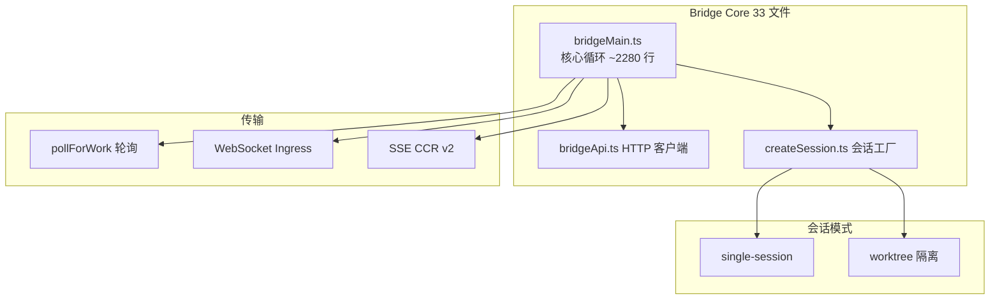

## Bridge 架构

Bridge 连接本地 CLI 与 claude.ai/code (及移动端)，通过轮询 + WebSocket 实现远程会话管理。



## 主循环流程

```mermaid
sequenceDiagram
    participant Loop as Bridge Loop
    participant API as Bridge API
    participant Proc as Claude Process

    Loop->>API: registerBridgeEnvironment()
    API-->>Loop: environmentId

    loop 主循环
        Loop->>API: pollForWork()
        alt 有新工作
            Loop->>Proc: spawn (claude --sdk-url)
            Loop->>API: heartbeat
        else 无工作
            Loop->>Loop: 指数退避
        end
    end
```

## 关键设计点

- **3 种会话模式**: single-session / same-dir / worktree (隔离 Git 工作树)
- **CCR v2**: `registerWorker` + SSE 替代 WebSocket
- **崩溃恢复**: Bridge Pointer 文件
- **受信设备**: Trusted Device Token 提升认证
- **默认 24h 超时**, SIGTERM → SIGKILL 升级关闭
