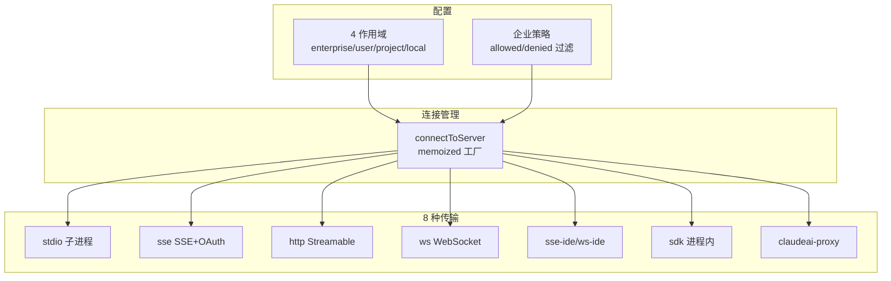
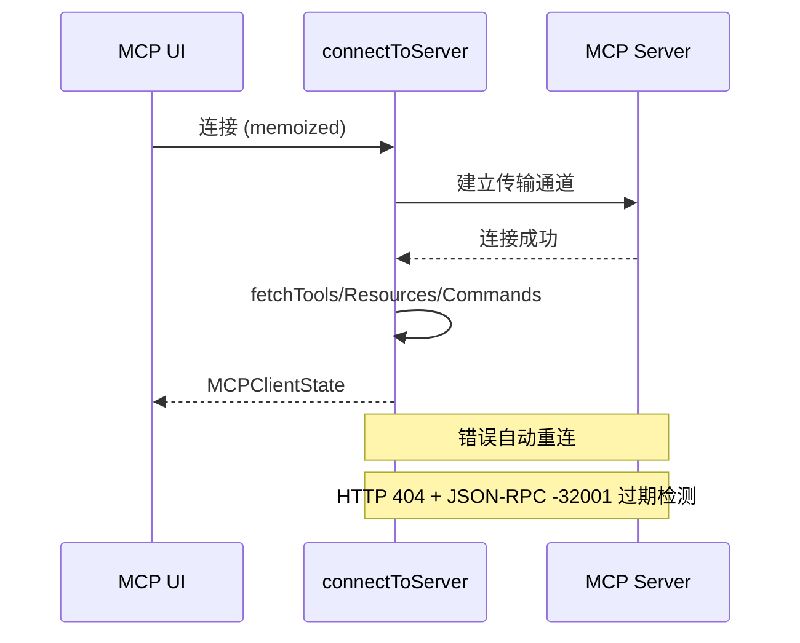

## MCP 架构

MCP 子系统支持 8 种传输协议，从 4 个配置作用域加载。

## 配置作用域

| 作用域 | 来源 | 优先级 |
|--------|------|--------|
| **enterprise** | 托管策略 | 最高 (独占控制) |
| **user** | 全局配置 | 高 |
| **project** | `.mcp.json` 向上遍历 | 中 |
| **local** | 本地配置 | 低 |

## 连接生命周期

## 进程内服务器

- **Chrome MCP**: 浏览器扩展集成
- **Computer Use MCP**: 屏幕控制
- **SDK MCP**: 同进程服务器 (无子进程开销)

## 关键文件

| 文件 | 行数 | 职责 |
|------|------|------|
| `services/mcp/client.ts` | ~3350 | 连接工厂 + 工具发现 |
| `services/mcp/config.ts` | ~1580 | 多作用域配置加载 |
| `services/mcp/types.ts` | - | Zod 模式 + 类型定义 |
