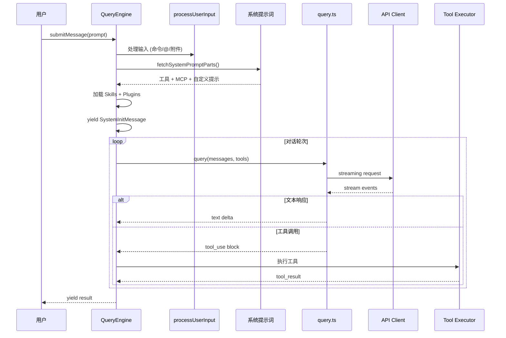
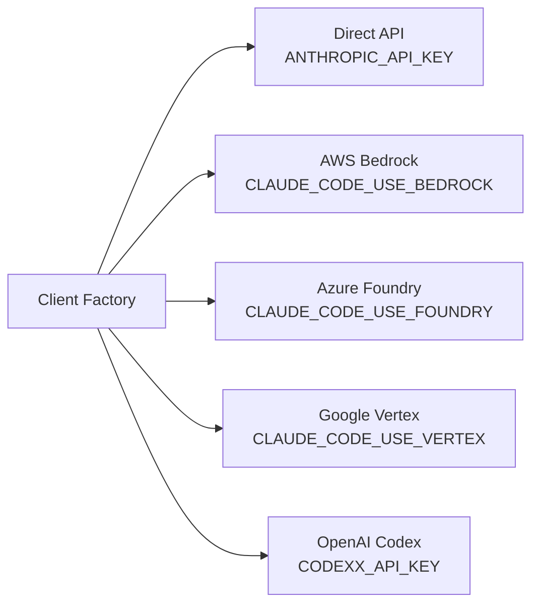

## 概述

`QueryEngine` (46 KB) 是系统的**核心大脑**，管理对话完整生命周期。

| 组件 | 文件 | 职责 |
|------|------|------|
| **QueryEngine** | `src/QueryEngine.ts` | 对话生命周期 |
| **query.ts** | `src/query.ts` (68 KB) | API 循环编排 |
| **claude.ts** | `src/services/api/claude.ts` | API 通信 |
| **tokenBudget** | `src/query/tokenBudget.ts` | 预算管理 |

## 完整查询流程

## `submitMessage()` 执行步骤

1. **重置状态** — 清除 discoveredSkillNames, 设置 CWD
2. **包装 canUseTool** — 追踪权限拒绝 (SDK 上报)
3. **获取系统提示** — 工具、模型、MCP、自定义
4. **处理用户输入** — 命令、工具选择、模型覆盖
5. **加载资源** — Skills + Plugins (仅缓存)
6. **产出 SystemInit** — 所有工具/命令/Agent/Skill
7. **主循环** — 委托 `query()` 进行 API 请求
8. **流式处理** — 累积消息、追踪用量、强制预算
9. **Transcript 持久化** — 多点保存，崩溃恢复

## API 客户端工厂

`getAnthropicClient()` 根据环境变量选择提供商：

## 关键设计决策

- **AsyncGenerator**: 流式产出结果，无需缓存完整响应
- **特性门控**: `feature()` 宏条件编译 (HISTORY_SNIP, COORDINATOR_MODE)
- **预算强制**: USD 限制、最大轮次、结构化输出重试
- **Transcript 持久化**: 多点保存支持恢复
