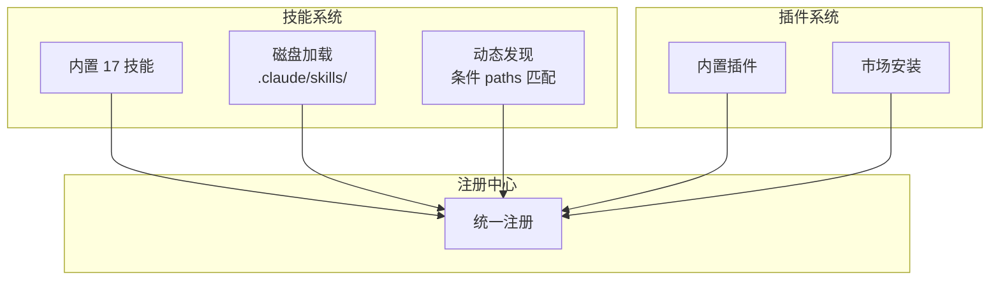

## 双轨扩展架构



## 技能系统

### 加载来源

| 来源 | 位置 | 特性 |
|------|------|------|
| **内置** | `skills/bundled/` | 17 个随二进制编译的技能 |
| **用户** | `~/.claude/skills/` | 全局 |
| **项目** | `.claude/skills/` | 项目级 |
| **动态** | 文件路径向上遍历 | 条件激活 |

### 技能 Frontmatter

```yaml
---
description: 技能描述
allowed-tools: [Bash, Read]
model: opus
context: inline | fork
paths: ["*.tsx", "src/components/**"]
hooks: [pre-sampling, post-sampling]
---
```

`paths` 字段 (gitignore 风格) 实现**条件激活** — 仅匹配文件被操作时激活。

## 插件系统

插件定义格式: `{name}@builtin`。可提供 skills、MCP 服务器、hooks。

- `/plugin` 命令浏览/安装/管理
- `PluginInstallationManager` 处理安装生命周期
- 签名去重防止重复连接

## 内置技能

| 技能 | 功能 |
|------|------|
| `claudeApi` | Claude API 参考 |
| `verify` / `simplify` | 代码验证 / 简化 |
| `loop` / `batch` | 循环 / 批处理 |
| `remember` | 记忆操作 |
| `skillify` | 从对话创建技能 |
| `updateConfig` | 配置管理 |
