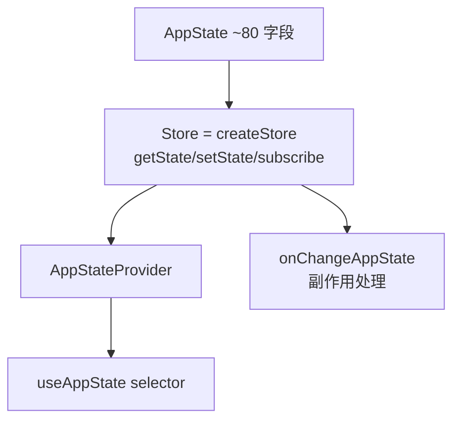
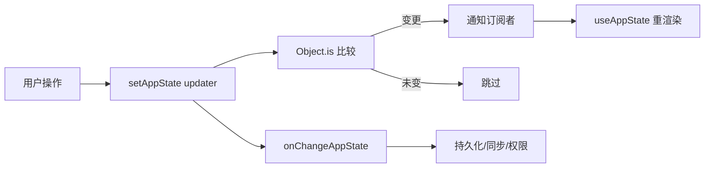

## 架构概述

使用**自定义轻量级 Store**（非 Redux/Zustand），基于 `useSyncExternalStore` 实现 React 集成。



## 核心文件

| 文件 | 职责 |
|------|------|
| `state/store.ts` | 通用 `createStore<T>()` — 极简可观察容器 |
| `state/AppStateStore.ts` | `AppState` 类型 + 默认值 |
| `state/AppState.tsx` | React Context Provider + `useAppState` hook |
| `state/onChangeAppState.ts` | 全局副作用: 设置持久化、权限同步 |
| `state/selectors.ts` | 计算状态选择器 |

## Store 实现

```typescript
function createStore<T>(initialState, onChange?) {
  let state = initialState;
  const listeners = new Set();
  return {
    getState: () => state,
    setState: (updater) => {
      const next = updater(state);
      if (!Object.is(next, state)) {
        state = next;
        listeners.forEach(fn => fn());  // 通知订阅
        onChange?.(state);              // 副作用
      }
    },
    subscribe: (fn) => { listeners.add(fn); return () => listeners.delete(fn); }
  };
}
```

## 数据流



## AppState 关键切片

- `settings` — 用户配置 (模型、主题、环境变量)
- `tasks` — 按 ID 索引的任务状态 Map
- `mcp` — MCP 客户端连接、工具、命令
- `plugins` — 启用/禁用的插件
- `toolPermissionContext` — 权限模式 (auto/interactive/coordinator)
- `notifications` — 通知队列
