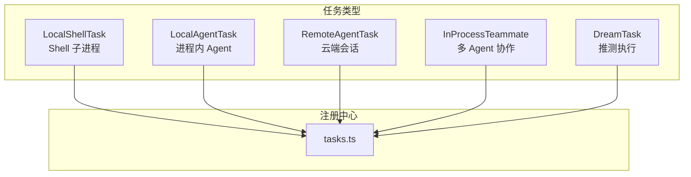
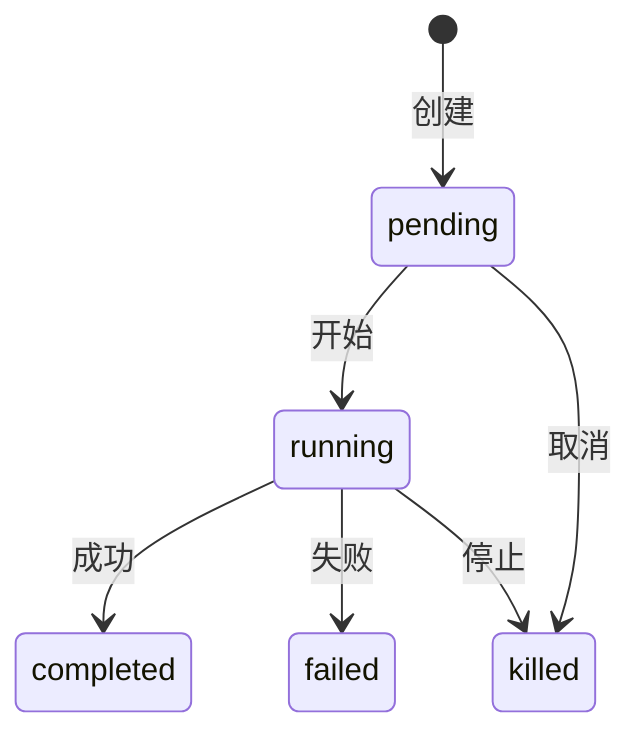

## 架构总览

## 任务类型

| 类型 | ID 前缀 | 用途 |
|------|---------|------|
| **local_bash** | `b-` | 后台 Shell 命令 |
| **local_agent** | `a-` | 子 Agent |
| **remote_agent** | - | 云端计算 (Ultraplan) |
| **in_process_teammate** | - | 多 Agent 协作 |
| **dream** | - | 推测执行 |

## 生命周期

## 后台会话

Ctrl+B 两次将主会话转入后台:
- `AsyncLocalStorage` 隔离 Agent 上下文
- 完成时 XML 通知
- SDK 进度摘要 (环形缓冲区，最近 5 个活动)

## stopTask 共享逻辑

`TaskStopTool` + SDK 共用 `stopTask()`:
- `StopTaskError` 含类型码
- 优雅关闭 → 强制杀死升级
