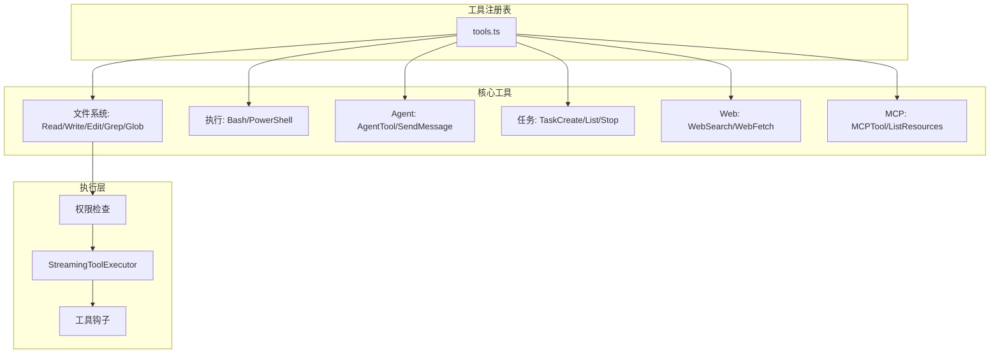
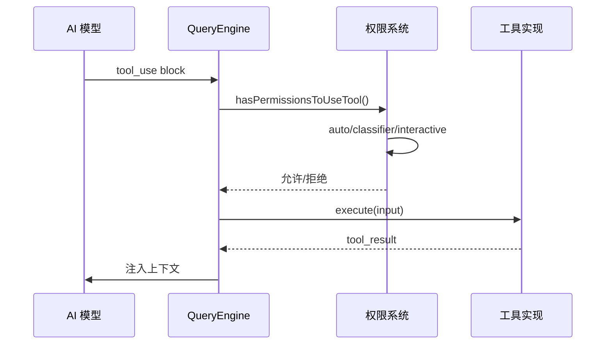
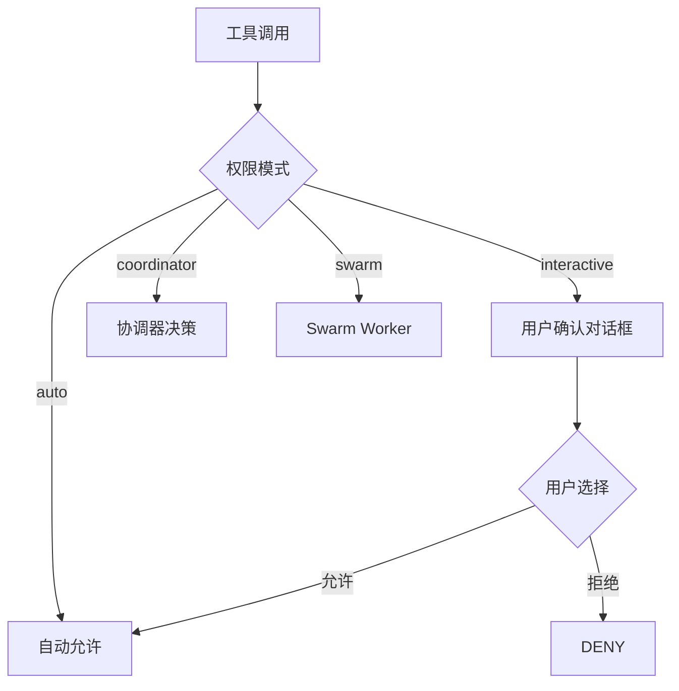

## 工具系统架构

每个工具包含：实现逻辑、UI 渲染组件、提示词指令、权限定义。

## 工具分类

### 文件系统工具
- **FileReadTool**: 文件读取 (含图片处理)
- **FileWriteTool**: 文件写入
- **FileEditTool**: 精确字符串替换 (含类型系统)
- **GlobTool / GrepTool**: 模式匹配 / 内容搜索
- **NotebookEditTool**: Jupyter Notebook 编辑

### 执行工具
- **BashTool**: Shell 命令 (17 文件: 权限、安全、破坏性命令警告)
- **PowerShellTool**: PowerShell (12 支持文件)

### Agent 编排
- **AgentTool**: 生成子 Agent (17 文件含内置 Agent)
- **TaskCreateTool / TaskListTool / TaskStopTool**: 后台任务管理
- **SendMessageTool**: 跨 Agent 通信
- **WorkflowTool**: 多步骤工作流编排

## 工具执行流程

## 权限路由

## 核心类型 (Tool.ts, 29 KB)

每个工具定义包含: `name`, `description`, `inputSchema`, `prompt` (模型指令), `feature` (编译时门控), `renderToolUse` (UI 渲染), `isEnabled` (运行时检查)。
