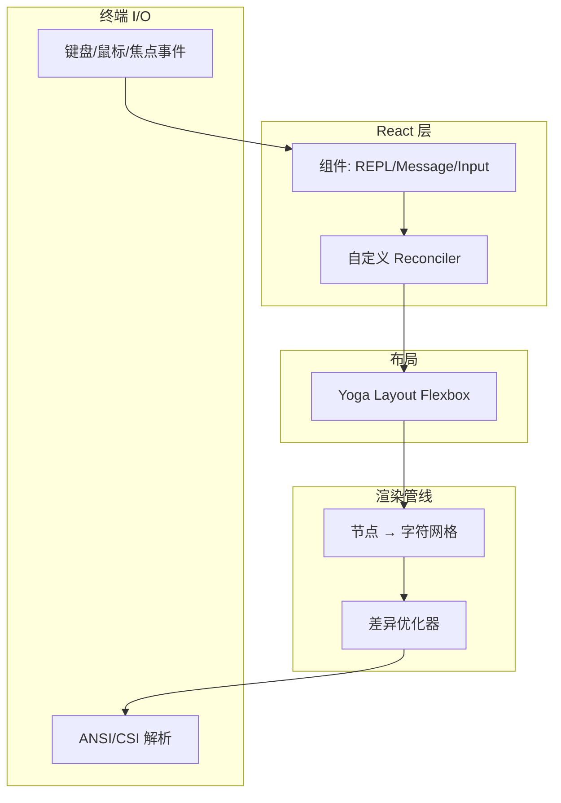
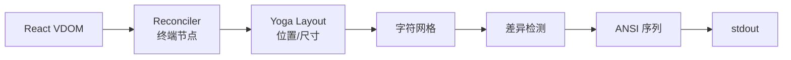

## 渲染架构

## 渲染流程

## 核心组件映射

| Ink 组件 | Web 对应 |
|----------|---------|
| `App` | `
` |
| `Box` | `
` (Flexbox) |
| `Text` | `` |
| `Newline` | ` ` |
| `ScrollBox` | `overflow: scroll` |

## 事件系统

- **KeyboardEvent**: 按键 + 修饰键
- **MouseEvent**: 点击/移动
- **FocusEvent**: 终端焦点
- **TerminalEvent**: Resize

## 文本测量

自定义实现 (无 DOM): 字符宽度 (CJK/Emoji)、ANSI 剥离、word-wrap 换行。
